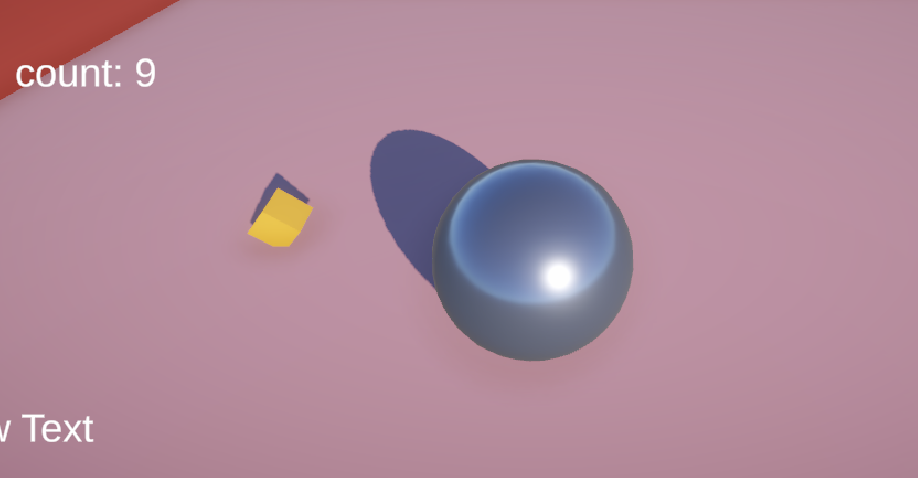

+++
title = 'My first Unity project: Roll-A-Ball'
date = 2024-10-06T13:11:57+02:00
slug = ""
authors = ["isaac"]
tags = ["homework"]
categories = ["lab-homework"]
externalLink = ""
series = []
+++

# Roll-A-Ball

## Introduction

Though we had a dedicated class for Unity, this class required that we follow the [Roll-a-Ball tutorial on the Unity website](https://learn.unity.com/project/roll-a-ball) in order to use it for a mobile application later (see "Unity on iOS" blog entry).


_You might remember I had mentioned this project in a previous blog entry._

## Idea of the game

The purpose of Roll-a-ball is pretty well summed up by the name. Our character is a ball and we roll it around. It can pick up objects and gain or lose HP. 



## Mechanics

- The ball uses physics (Rigidbodies) and a simple Input system. 
- The items use the Prefab principle in order to be easily duplicated. 

## Tricky things to pay attention to

### Tags

We use a tag system in order to let the game know whether we picked up a "good" or "bad" item (i.e. items which respectively increase or decrease our health). The good and bad items are Prefabs, and each class has a parent, so their tags are either PickUpGreenParents or PickUpOrangeParents.

```
private void OnTriggerEnter(Collider other)
    {
        if (other.gameObject.CompareTag("PickUpGreenParents"))
        {
            HP += 1;
        }

        if (other.gameObject.CompareTag("PickUpOrangeParents"))
        {
            if (HP > 0)
            {
                HP -= 1;
            }
        }
```

_Above: the code used to update the health depending on the object we picked up. the HP variable goes up by 1 unit when a Green object is picked up, and goes down by 1 unit (as long as there are remaining HP points) when an Orange one is collected._

### Rigidbodies

Rigid bodies can be tricky to work with, with all sorts of jittering motion when they are not well handled. Their origin, collisions, forces and the uniformity of their scale (scaleX = scaleY = scaleZ) must be taken into account*.

*i found out about this issue randomly during the unity class, when we were tasked to have a camera following the main character, and the rotation was strange. i later realized this was due to non-uniform scaling of the character, which resulted in an elliptic rotation of the camera rather than circular. 


## Possible ways to improve the game

With enough time, I could add SFX (sound effects), visual effects, a fancier HP counter, a startup & game over screen...


