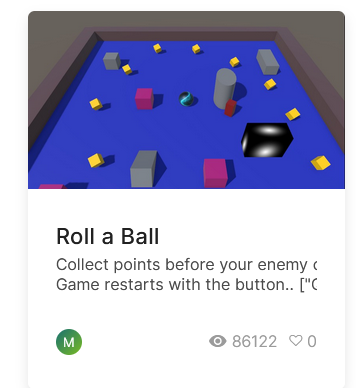

+++
title = 'my first unity project'
date = 2024-10-06T13:11:57+02:00
slug = ""
authors = ["isaac"]
tags = ["homework"]
categories = ["lab-homework"]
externalLink = ""
series = []
+++

# Roll-A-Ball

## Introduction

Though we had a dedicated class for Unity, this class required that we follow the [Roll-a-Ball tutorial on the Unity website](https://learn.unity.com/project/roll-a-ball) in order to use it for a mobile application later (see "Unity on iOS" blog entry).



_You might remember I had mentioned this project in a previous blog entry._

## Idea of the game

The purpose of Roll-a-ball is pretty well summed up by the name. Our character is a ball and we roll it around. It can pick up objects and gain or lose HP. 

## Mechanics

- The ball uses physics (Rigidbodies) and a simple Input system. 
- The items use the Prefab principle in order to be easily duplicated. 

## Tricks & Things to pay attention to

### Tags

We use a tag system in order to let the game know whether we picked up a "good" or "bad" item (i.e. items which respectively increase or decrease our health). The good and bad items are Prefabs, and each class has a parent, so their tags are either PickUpGreenParents or PickUpOrangeParents.

```
private void OnTriggerEnter(Collider other)
    {
        if (other.gameObject.CompareTag("PickUpGreenParents"))
        {
            HP += 1;
        }

        if (other.gameObject.CompareTag("PickUpOrangeParents"))
        {
            if (HP > 0)
            {
                HP -= 1;
            }
        }
```

_Above: the code used to update the health depending on the object we picked up._


