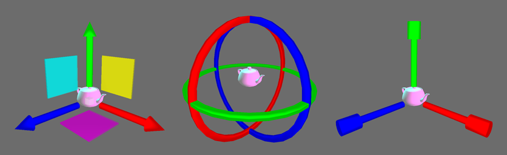

+++
title = 'A prominent HCI researcher: Ben Shneiderman'
date = 2024-09-30T18:12:40+02:00
slug = ""
authors = ["isaac"]
tags = ["homework"]
categories = ["homework2"]
externalLink = ""
series = []
+++

## Introduction

Research in the field of HCI has been conducted in the past century and in ours by researchers such as Vannevar Bush, J.R. Licklider, Ivan Sutherland, Douglas Engelbart (invented the computer mouse), Stuart Card, Don Norman, Alan Kay, and Mark Weiser. Another researcher, whose work did not appear in our HCI course, is Ben Shneiderman, who today's blog post is about.

## Ben Shneiderman & the 8 golden rules of interface design

Ben Shneiderman can be considered a HCI pioneer. He introduced, in 1986, the "Eight Golden Rules of Interface Design" in his influential book "Designing the User Interface". These rules have become ubiquitous in the field of UI design. The rules put emphasis on:

* Consistency,
* Shortcuts (for frequent users), 
* Informative feedback, 
* Dialog design,
* Simple error handling, 
* Easy reversal of actions (Undo, Ctrl+Z),
* Letting users feel like they are initiating actions rather than receiving them, and 
* Reduced short-term memory load for users. 

Shneiderman's guidelines have stood the test of time, continuing to influence modern interface design across various platforms and applications. They provide a practical framework for creating user-friendly, efficient, and intuitive interfaces that enhance the overall user experience.

## Pioneering the direct manipulation interface

Shneiderman's work also planted the seed for touchscreens, finger painting, and highlighting text in editors. Indeed, he analyzed user needs and concluded there was a need to push for continuous representation of objects, paired with fluent, reversible and incremental actions. 
For instance, to manipulate a 3D object, typing commands may be considered tedious, while using a translation/rotation/scale-type widget feels much more adapted.

_References: [wikipedia](https://en.wikipedia.org/wiki/Direct_manipulation_interface), [wikipedia](https://en.wikipedia.org/wiki/Ben_Shneiderman)_