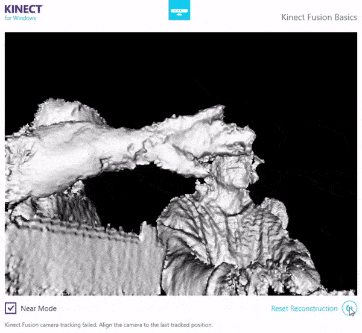
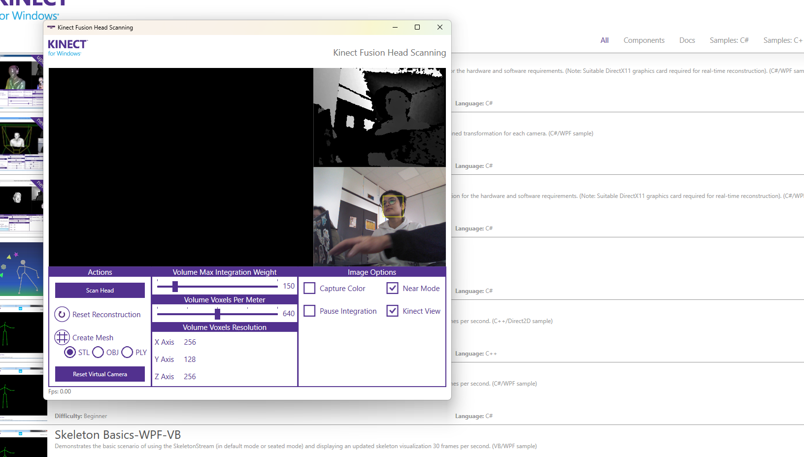
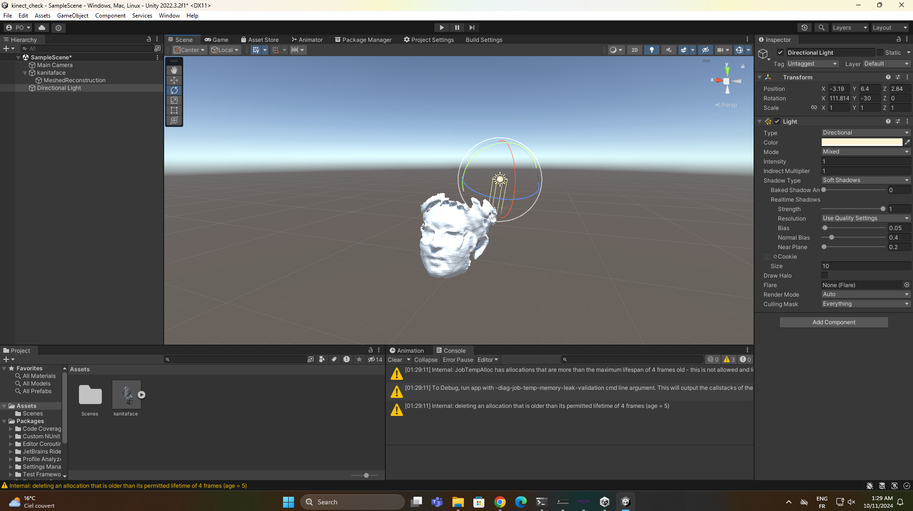
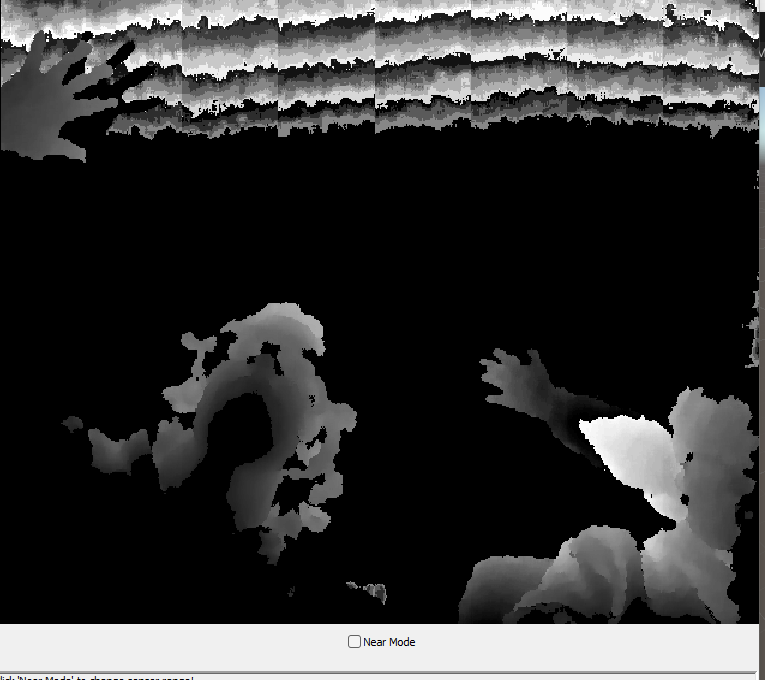
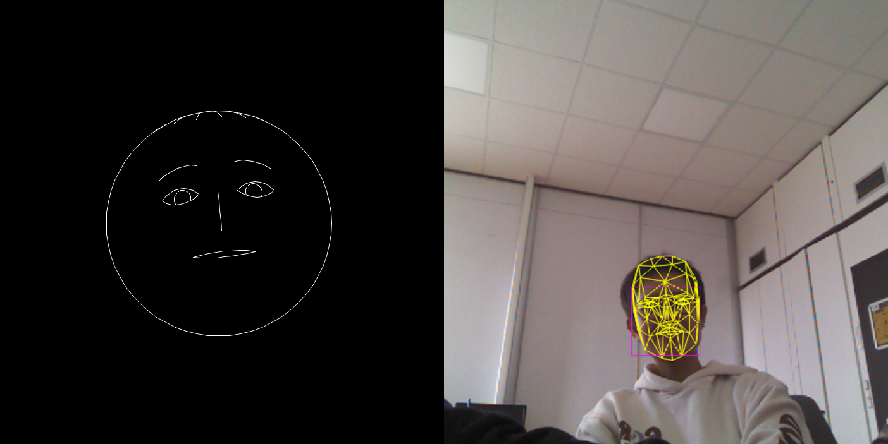
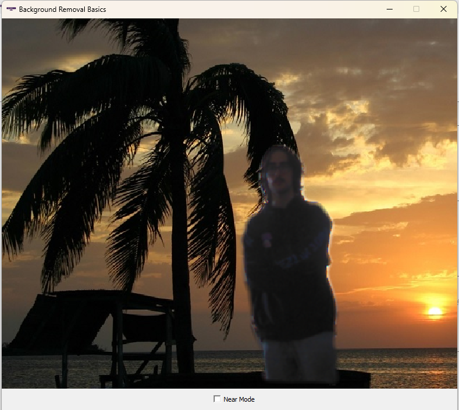
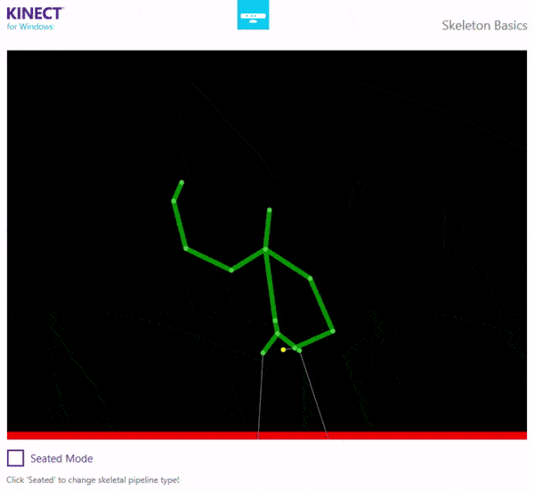

+++
title = 'Fun and instructive uses of the Kinect camera'
date = 2024-03-11T23:07:19+02:00
slug = ""
authors = ["isaac"]
tags = ["homework"]
categories = ["lectures-10-11-12"]
externalLink = ""
series = []
+++

In this lab, we were given access to a Kinect camera. Here are some of the many applications of its depth-sensing technology, paired with its video capabilities.

_Note: we had a lot of technical issues, so we might have not been able to fully explore all of the uses of this technology, but we did manage to make a few of them work, as shown below._

# Kinect Fusion Basics

The first app we used is called Kinect Fusion Basics. At first, we were confused as to what it was made for:

_We first thought this app was meant to detect movement, but in fact, it does not even handle it properly._

We then figured out its use: 3d scanning of an object/environment. It uses computer vision techniques for 3d reconstruction, which take advantage of the depth sensor to estimate position and rotation relative to previous coordinates. From there, we can pretty accurately reconstruct our environment (here, the lab room):

_Footage has been sped up x3._

A caveat of this technique is that it is not robust to reflective surfaces, as shown with the laptop screen which we really struggled to reconstruct. All the rest is quite good and could be used as a basis for 3d modelling.

# Kinect Fusion Head Scanning

Using similar techniques, we can achieve facial reconstruction:

After some cleanup using Blender's Remesh and Decimate features (simplify the mesh and make it easier to render), we managed to import our classmate's face into Unity:

Once again, the results are quite accurate, except for the glasses which are too complicated to reconstruct accurately due to the transparent and reflective surfaces. Still, the accuracy of the face is impressive!

# Simple depth visualization

This app showcases the depth sensor's capacities. The depth is shown with a gradient from white to black, which cycles between the two in order to have noticeable changes when a small movement on the Z axis is made (otherwise, if white = close and black = far, we need to move a lot in order to see the change in color of our silhouette).

There is a "near-mode", which seems to make use of a different setting on the sensor, more adapted to depth sensing for nearby objects. 

# Facial structure/emotion detection

This app uses computer vision to detect faces and the position of their features, allowing for emotion detection and a "universal" representation of the face someone makes (shown on the left).

# Background removal

In this app, depth information is used to estimate what parts of the image constitute the background, allowing for subject selection and isolation. It performs live background removal, which is a task that is now mostly done with ML-based workflows, but here it uses depth sensor information.

The fact the sensor is not exactly located where the camera is causes a mismatch for shapes close to the camera: where they appear on the depth sensor and on the camera is different, so the border of the objects is shifted compared to where it should appear. 

# Pose estimation

Last but not least, this app performs skeleton-style pose estimation. As we can see in the above example, it performs quite well even in fast motion situations (in this case, some of my worst dance moves). 

When we get closer to the camera though, the skeletons tend to glitch out, as the camera no longer sees the entirety of the body and the program gets confused as to where the skeleton parts should be placed. 