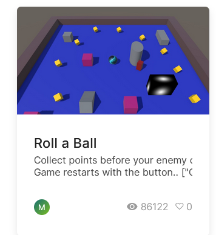

+++ 
date = 2024-09-17T12:49:25+02:00
title = "Set up a blog and the Unity engine"
description = "(if you see this, it probably means I set the blog up correctly.)"
slug = ""
authors = ["isaac"]
tags = []
categories = []
externalLink = ""
series = []
+++

## Setting up the blog

### Getting familiar with Hugo

We used the Hugo framework and GitHub's hosting services. I knew about the latter but Hugo was something new for me. I must admit, it was also nice to have my memory refreshed a bit on the usual git commands... I only remembered `commit` and `push`.

```console
git status
git add .
git commit -m "my commit message"
git push -u origin main
```

_The above is the usual process to update changes made to a repository. (Note 26/10/2024: I used this again in the Unity homework recently! this process is useful to make sure we are pushing everything and adding a meaningful commit message)_

But, apart from the few commands I had forgotten, most of it was very straightforward. We followed similar instructions to what is given on the Hugo website in the "Quick start" section. It is pretty complete:

[The "Quick Start" section in question -- it contains everything you need](https://gohugo.io/getting-started/quick-start/)

You can also browse through [dozens of themes for Hugo at this link](https://themes.gohugo.io/).

### Images are tricky

They really are. It took a little while to manage to make them work, but:

> [!NOTE]
> The second method in [this StackOverflow thread](https://stackoverflow.com/questions/71501256/how-to-insert-an-image-in-my-post-on-hugo) works perfectly if you need a quick and reliable way to add images to your article.

 

### Using GitHub Pages

Here is [a video tutorial](https://www.youtube.com/watch?v=n12fzB6OOO4) on how to freely host a static website using GitHub Pages, which is what I use for this blog.

### And now...

...all I need is to write articles!


## Setting up Unity

We had already set up the Unity engine in the dedicated class, so this was mostly the same as what we had done during the week prior. 

Some of what we were taught:
- GameObjects: 3D meshes, etc
- Assets: Materials, Prefabs (instance-able objects), C# scripts
- Components, including Physics (Rigidbodies)
- Basics of C# scripting
- Basics of UI and Scenes management

I now feel comfortable using all of these elements together. Considering the assignment for our Unity class is a simple game using the mechanics we studied during the dedicated class, I feel like I will be able to get enough practice with both classes combined in order to master the basics of unity at the end of the semester. _(Note 26/10/2024: I did get a good amount of experience as I was able to complete the creation of a simple game using Unity, available at [this link](https://github.com/patoracode/HighRiseSurfers))_

A good project for beginners with Unity is Roll-a-ball, which we actually implement later in this course.

[Unity: Roll-a-ball, a good project for beginners](https://learn.unity.com/project/roll-a-ball)

