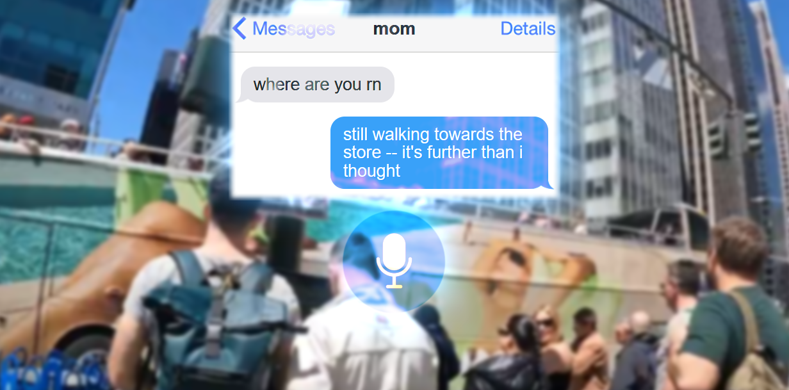
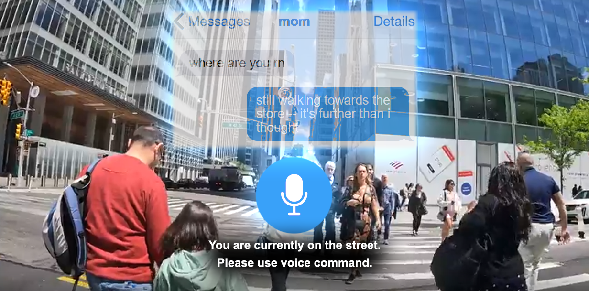
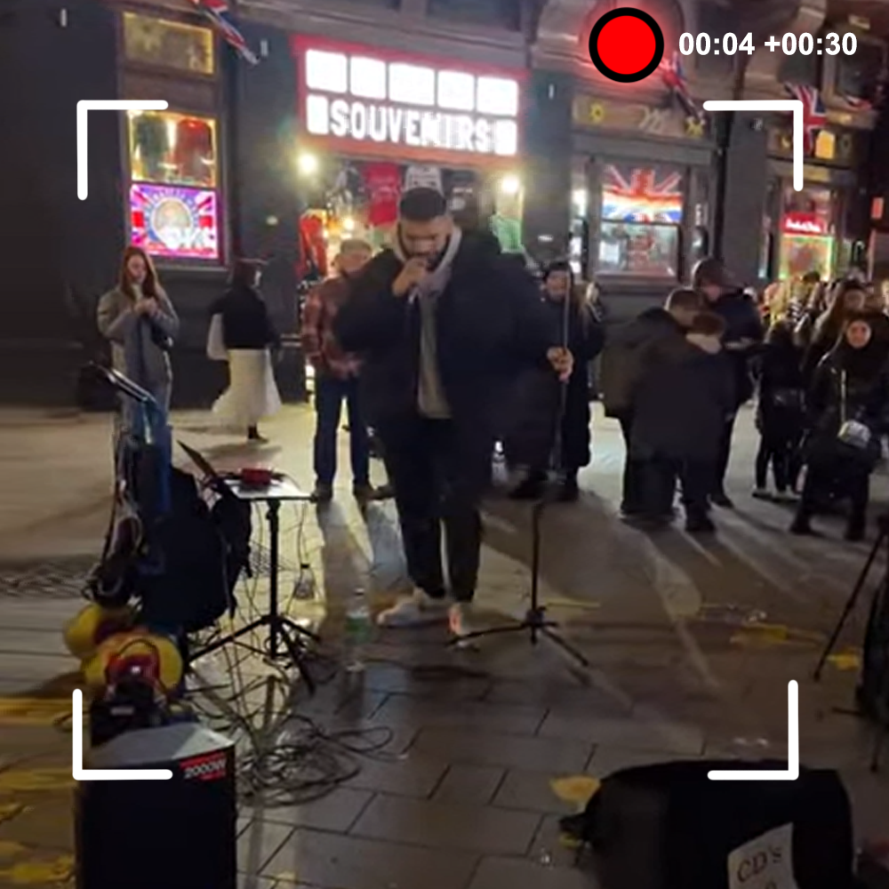

+++
title = 'Most downloaded apps of the future Mixed Reality App Store'
date = 2024-10-26T22:02:58+02:00
slug = ""
authors = ["isaac"]
tags = ["homework"]
categories = ["lectures-10-11-12"]
externalLink = ""
series = []
+++

_Imagine a future where MR HMDs are as ubiquitous as smartphones. Think about the future App Store. Sketch and present three applications that you think will be among the most downloaded. Explain why you think this might be the case?_

A couple posts ago we discussed some of our own ideas for VR/AR -- this time, we will try to think about the most downloaded ones in the case MR HMDs (mixed-reality head-mounted displays) become a common thing.

# Idea #1: Smart messaging app

Messaging/calling is still the most common use for mobile computers, which currently still take the form of smartphones. If smartphones are replaced by MR head-mounted displays, messaging and calling will not disappear, and I believe they will in fact stay the #1 most important aspect of mobile computing.

This app has safeguards so users can send messages while being outside, but not when they are on the street or while driving, for instance. 

Users can send voice messages or dictate them, as even today, automatic speech-to-text is pretty accurate (at least in English).

# Idea #2: Photo app

The ex-aequo #1 current use of smartphones is picture- and video-taking. This app constantly records -- in a **secure, private way** -- everything that the HMD sees, and lets you save the 30 latest seconds of video, or take a snapshot, or take a custom-length video starting up to 30 seconds prior to when the button is pressed. 

This lets users be more in the instant if something worth recording happens, as they do not need to pull out a device and hit record: they can simply look at it.

The question of selfies is still unanswered: how to satisfy the current (and ever-growing) need for selfishness if the camera can only point outwards?

# Idea #3: Ad-blocker

If users still care about their personal rights, the ad-blocker I [designed in detail a couple posts ago](https://patoracode.github.io/varblog/posts/prototyping/#idea-3-arxr-adblocker) might come in handy.