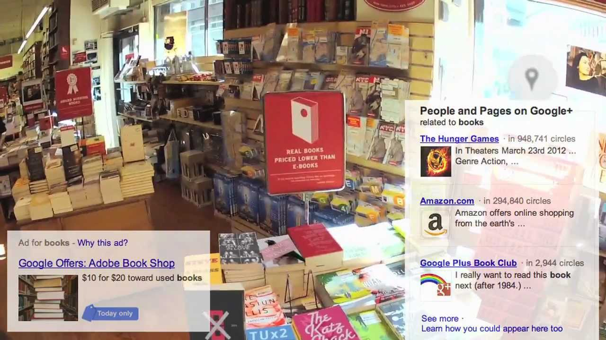

+++
title = 'Prototyping AR ideas'
date = 2024-10-12T19:49:01+02:00
slug = ""
authors = ["isaac"]
tags = ["homework"]
categories = ["prototyping"]
externalLink = ""
series = []
+++

_Task: Enhancing human abilities in the age of augmented reality._

Steps: 
- Ideation: create, sketch & present 3 ideas
- Prototyping: build a prototype that is good enough to have a first user exposure
- Evaluate: ask someone to interact with our prototype; observe and discuss with them what their opinion is towards our concept and interaction; critically reflect.

# Ideation

## Idea 1: AI equation helper

### The Idea

As a former "prépa" student, I have been stuck countless times on math or physics problems, but finding help for them is often non-trivial. Apart from asking the teacher or a friend, it could be useful to have an assistant which helps us understand what possibilities we have and what are the usual methods to solve X or Y problem. A LLM could be trained to focus on math/physics/chemistry/engineering problems, with knowledge of the classic ways of solving classic problems. One of the issues is also the fact many math or physics exercises contain greek or non-latin letters. To help with the tedious task of copying and pasting half of the greek alphabet, an advanced OCR algorithm could let us scan our writing with our phone, including the non-latin letters, and append LLM chatbot ideas at the end of the page. The interface would be similar to Google Translate's live translation features, with simple text boxes pinned to the right parts of the page thanks to motion tracking. 

I believe such a tool would simplify web searches in the context of science problems. Of course, this tool is **only for learning**, and is **forbidden during tests**!

### The Sketch

I made the sketch in Photoshop, featuring my own hand and phone, and signal processing equations from last year.

## Idea 2: Piano assistant

### The Idea

At the end of my music school curriculum, I took two years of piano classes, and during those two years, the teacher would keep telling me to better position my hands. In a similar fashion to the previous example, I believe simple motion tracking and specific AI/neural network training can go a long way to help musicians have better posture: in this case, we train the AI to recognize and correct hand poses while the person is playing, with the phone held by the teacher or somebody else. Motion tracking is performed on the hands to ensure continuous analysis of their shape, and on the piano to keep track of its relative position to the hands. 

Of course, this is merely an example case of a broader class of apps, which could be used for other instruments, sports, or even military training. 

### The Sketch

_(I reused the picture I took of my phone in my hand.)_

## Idea 3: AR/XR adblocker

### The Idea

Advertising is useful for companies who want to let us know about their products. But what if we don't want to know? _At all?_
This idea came up to me a long while ago, as I was realizing ad-blockers were not adaptive enough, since we are constantly shown advertisements inside and outside of our screens. The possibility to block out commercials and advertisements closest to the user's eyes might be one of the most effective, if not beneficial uses of AR in my opinion. Even for a simple picture taken with a phone: a huge billboard or advertisement screen could ruin a moment we are trying to capture. This idea would use a neural network trained to recognize advertisements, and motion tracking to pinpoint and track what to block out.

This is also inspired by [this video](https://www.youtube.com/watch?v=_mRF0rBXIeg), which I saw as a kid around when it came out (2012). It was poking fun at what progressively became the main business model of most big tech companies: selling user data to improve targeted ads.

### The Sketch

# Prototyping

## The process

The idea we choose to make into a working prototype will be Idea #3, the Adblocker solution. 

Building this prototype has helped me realize there are _many_ edge cases in ad-blocking. There are already many in regular online ad-blocking, but here they can actually cause hazard. Just like with self-driving cars, there needs to be specific attention given to edge cases so that nobody gets hurt by, say, a road sign being obstructed for looking like an ad.

_The process of cutting out ads in Photoshop_

I tried out multiple colors for the _blockers_.

_The "Blue Screen of Death" on all the screens..._

_Or perhaps something calming for the eyes, like this beige color._

In the end, my favorite one was just a simple Gaussian Blur applied to the base image.

## The final prototype

Once imported into Blender, here is what the demo looks like, once the selective ad-blocking blur filter is applied:

_Times Square, minus the ads_

# Evaluation

A friend of mine tried out the demo for a couple minutes. His main comments (and my responses) were:

- Times Square is both a good and a bad example for this technology. On one hand, there are many ads, which highlights the work that the software does. We can also better focus on the people and the buildings because our attention is "restored". But on the other hand, the fun part about Times Square is the fact there are so many ads to look at that there is a sense of bewilderment, which is absent from this demo.
_My response: This is absolutely true, but with this short demo, I mostly tried to showcase the lengths this idea can go to. Therefore, the emphasis was put on the amount of ads blocked._

- Doing this on a live video feed might be a tough process.
_My response: It will, but there is hope, as computers/graphic cards have been getting faster, and neural networks are more and more precise and effective._

- This is a very useful concept, however considering how much the tech industry relies on ads, I'm not sure if you can find much funding for it...
_My response: Just like with current ad-blockers, we are not really working hand-in-hand with tech/advertising companies. Crowdfunding is always an option._  

- What if I want to look at the ads for a bit?
_My response: **There will be an always-on-screen "unblock ads" button, in case we want to look at them. This is also for the safety of the users, in case something gets falsely flagged as being an ad but actually contains crucial information.**_

# Final note

I believe this third idea could be a great project to do over the course of a few months. My friend's experience and his comments have definitely helped me realize some limitations of this idea, though I am happy to say that I had anticipated quite a few of them. 
That being said, neither I nor anyone I know has the tools necessary to build this at the moment. This idea will therefore have to wait.