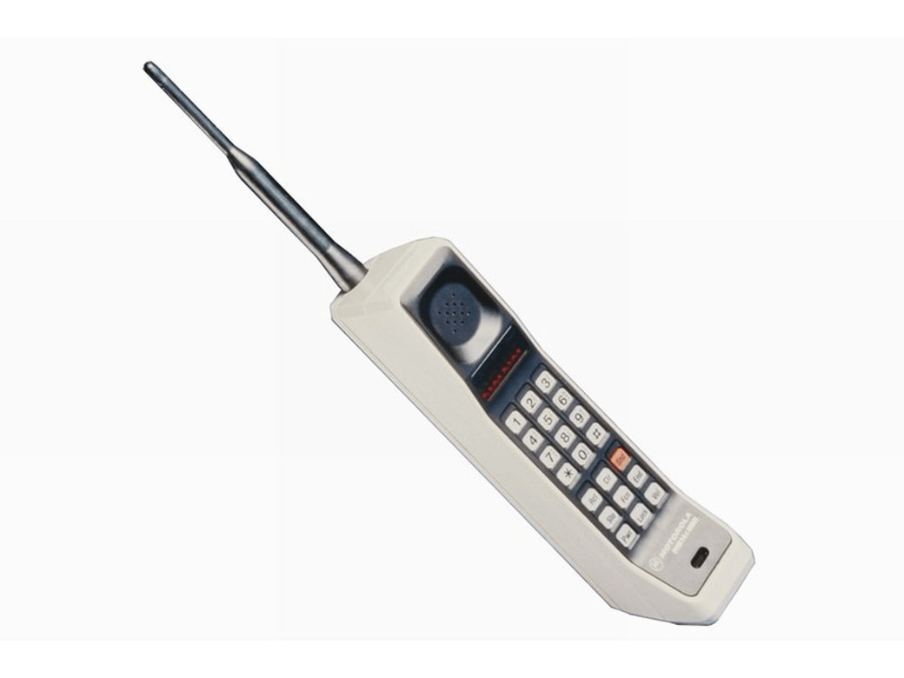

+++
title = 'The shape of smartphones: a retrospective'
date = 2024-10-26T17:02:18+02:00
slug = ""
authors = ["isaac"]
tags = ["homework"]
categories = ["lectures-10-11-12"]
externalLink = ""
series = []
+++

Last year I had an English class about recent digital evolutions and their impacts on society. What I remember vividly is getting to look at and hold mobile phones from the past. Their shape has changed drastically and this change deserves to be talked about and explained.

# Miniaturization: From the "brick" to paper-thin designs

In the 1980s, mobile phones were essentially bricks—think the Motorola DynaTAC. 

They were uncommon, heavy, huge, and limited to making calls. As tech advanced, phones started shrinking, allowing for portability and style to diversify. By the early 2000s, designs like Motorola's Razr, with its ultra-slim (at the time), flip-open form, became fashionable, showing that phones could be both practical and trendy. And the practical aspect would only become more and more true.

With the launch of the iPhone in 2007, touchscreens and miniaturization took over. Gone were the physical keyboards and keypads, replaced by a big, interactive screen, which almost covers the entirety of the front face of the phone. Phones became thinner, maximizing display size while keeping a slim profile. The "candy-bar" style took off, designed to make full use of every inch of screen space.

# The shape evolves with the usage

It's quite obvious: how we use our phones shapes how they look. In the early days, phones were built just for calling and texting, so they didn’t need big screens. But as we started using them for photos, video (which already represents **70% of the Internet traffic**), gaming, and various apps, the design shifted to adapt to all these functions. Screens grew larger, bezels got smaller, and devices had to fit a lot of tech in a small space.

Today’s smartphone shape mostly includes large touchscreens and a minimal bezel. It is a direct result of our multitasking needs. Specialized phones also cater to specific uses, like gaming phones with better cooling or rugged phones built for outdoor work. Each change in shape has reflected a new way that people are using their phones.

# Nostalgia?

Lately, people have been drawn to phone designs that look different from the usual rectangle. Foldable phones, like the Galaxy Z Fold and the new Motorola Razr, bring back the old flip-phone style with modern tech, offering a big screen that can still fit in your pocket when folded. These designs mix the classic look with today’s technology, giving us a break from the same flat shapes we've had for years.

Foldables and other new designs show that people miss the unique look of early mobile phones, when each model stood out. This mix of old-school style with new features gives us something fresh yet familiar, AKA the usual recipe for success.