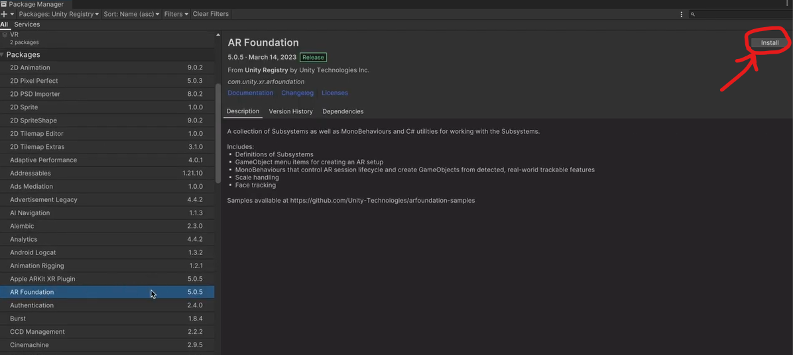

+++
title = 'How to make basic VR and AR applications'
date = 2025-01-18T21:31:14+02:00
slug = ""
authors = ["isaac"]
tags = ["homework"]
categories = ["ar-vr"]
externalLink = ""
series = []
+++

# Simple VR setup in Unity

My classmate Valentin Dorard and myself created a basic Unity VR setup. The full project steps are available here:

[VR SETUP IN UNITY, FULLY DETAILED STEPS](https://vdorard.github.io/work/vr_lab-feat-isaac-bes/)

## Main points in Valentin and I's implementation

We used the basic Unity 3D template, paired with the [XR Interaction toolkit](https://docs.unity3d.com/Packages/com.unity.xr.interaction.toolkit@3.0/manual/index.html).

We add an XR Origin, and turn on Oculus in the XR Plug-in Management, which can be found in the Project Settings.

The XR Camera contains (as children) XR Controllers for the two hands. 

An important trick: a template called **XRI Default Input Actions** can be selected, and it speeds up the process of setting up all the References in the XR Controller. 

The template is here:

And the panel ends up looking like this:

We can use a Hand prefab as a Controller, and start playing.

Again, a more detailed version of this guide is available [here](https://vdorard.github.io/work/vr_lab-feat-isaac-bes/)!

# AR Application in Unity

Another class had us creating a basic Tap-to-Place AR Application, so here is how to do just that:

## AR Setup

We use the basic Unity 3D Template.

We then set the project to be ported to Android.

In the Package Manager, we install AR Foundation.

When prompted with the warning "This project is using the new input system package but the native platform backends...", click **Yes**.

In the Project Settings, make sure to enable Google ARCore as shown here:

Then, in Project Validation, under XR Plug-in Management, hit **Fix all** if any errors pop up.

Now, in the project, delete the **Main Camera** and add an **XR Origin** (found in the XR drop-down).

The **XR Origin** should contain a **Camera Offset** child.
Now, add an **AR Session** component.

Add an **AR Default Plane**, which can be found under the same XR menu as shown above.
Drag it to a (new) Prefabs folder in your Assets, in the Project window. This turns it into a Prefab.

You can now delete the **AR Default Plane**.

Add an **AR Plane Manager** component to the **XR Origin**, as shown below.

Similarly, also add an **AR Raycast Manager** to the **XR Origin**.

Go to the Package Manager. Make sure you are in the Unity Registry (top-left). Scroll down to XR Interaction Toolkit on the left. Click **Install**.

Similarly to how we added the **AR Raycast Manager** earlier, let's add an **AR Gesture Interactor** to the **Main Camera**, which is a child of the **Camera Offset**, which itself is a child of the **XR Origin**.

In the scene, add an **XR Interaction Manager**, which can be found in the same XR drop-down as seen earlier.

Select the **Main Camera** and drag the **XR Interaction Manager** to the Interaction Manager option found in the **AR Gesture Interactor**.

Make sure the XR Origin setting, found a little under the Interaction Manager one, is also set to be the **XR Origin** found in the scene. If not, drag it from the scene Hierarchy as we did for the Interaction Manager.

In the hierarchy, add an **AR Placement Interactable**, found in our now-familiar XR drop-down, and add a simple **Cube** 3D Object.

Drag the **Cube** to the Prefabs folder, and delete its instance from the hierarchy, as we did with the **AR Default Plane**.

Now, with the **AR Placement Interactable** object selected, drag and drop the Cube prefab to the Placement Prefab setting under the AR Placement Interactable component. 

Now, save the scene, build it for Android with an Android device plugged, and you're good to go!

## Further Extensions

You can download assets from the Unity Asset store, add some simple UI and animations for a fancier project. 

Here is my prototype: a Tap-to-place app featuring a dice (or more), which can be rolled.

 